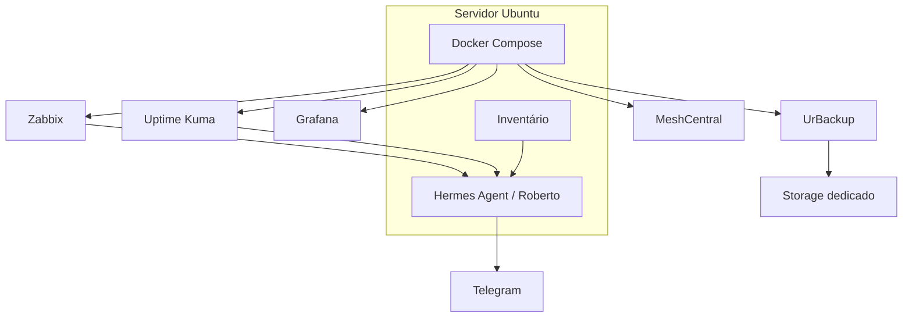

# Diagrama de arquitetura

```mermaid
flowchart TB
    subgraph Host["Servidor Ubuntu"]
        Compose["Docker Compose"]
        Roberto["Hermes Agent / Roberto"]
        Inventory["Inventário"]
    end
    Compose --> Zabbix
    Compose --> Grafana
    Compose --> Kuma["Uptime Kuma"]
    Compose --> Mesh["MeshCentral"]
    Compose --> UrBackup
    UrBackup --> Backup["Storage dedicado"]
    Zabbix --> Roberto
    Kuma --> Roberto
    Inventory --> Roberto
    Roberto --> Telegram
```
