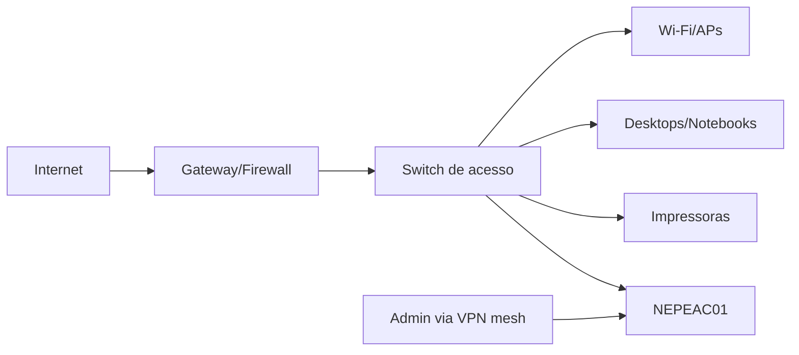

# Diagrama de rede

```mermaid
flowchart LR
    Internet["Internet"] --> Gateway["Gateway/Firewall"]
    Gateway --> Switch["Switch de acesso"]
    Switch --> Server["NEPEAC01"]
    Switch --> Printers["Impressoras"]
    Switch --> PCs["Desktops/Notebooks"]
    Switch --> APs["Wi-Fi/APs"]
    Admin["Admin via VPN mesh"] --> Server
```
